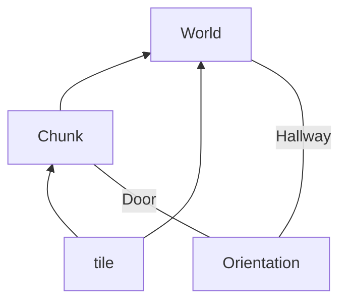
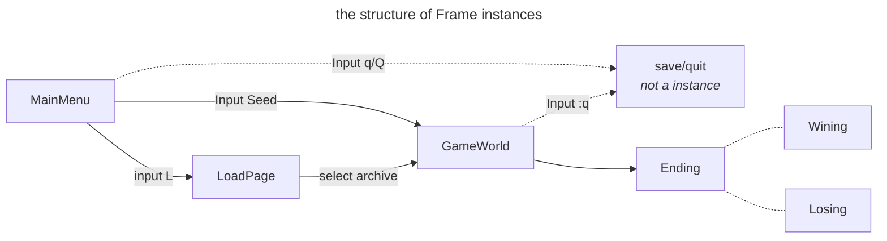

# 0. project describe
The design doc of project3, CS61B. Contributed by WauZonC.
# 1. Specifics
## 1.1. file structure:
```
src:
    -core
        -> AutograderBuddy
        -> Main
        -> World
    -tileengine
        -> TERenderer
        -> TETile
        -> Tileset
    -utils
        -> FileUtils
        -> RandomUtils
tests:
    -> WorldGenTests
```
## 1.2 skeleton code
### 1.2.1 tileEngine
provides some basic methods for rendering, as well as basic code structure for tiles,     
contains:
```
TERenderer.java
->  contains rendering-related methods.
TETile.java
->  the type used for representing tiles in the world.
Tileset.java
->  a library of provided tiles.
```
### 1.2.2 core
contains everything unrelated to tiles:
```
AutograderBuddy 
->  Provides two methods for interacting with your system.
    TETile[][] getWorldFromInput(String input) simulates the game without rendering
    by returning the world that would result if the input string had been typed on 
    the keyboard.
    You should fill this out for autograder.
Main
->  How the user starts the entire system.
    Reads command line arguments and calls the appropriate function in World.java.
World.java
->  YOUR WORLD!
    (You can create any other classes if you want.
        Primarly, you can use World.java for the logic behind your world creation.)
```
### 1.2.3 utils
contains everything that you might need to implement your World.java class:
```
RandomUtils.java
->  Provides handful of functions that might be useful.
FileUtils.java
->  Library of simple file operations.Be sure to look at lab09 for a refresher on how this works.
```
## 1.3 proj 3a criteria
### 1.3.1 valid
- The world must be a 2D grid, drawn using tile engine.
- The generated world must include distinct rooms and hallways, though it may also include outdoor spaces.
- At least some rooms should be rectangular, though you may support other shapes as well.
- Your world generator must be capable of generating hallways that include turns (or equivalently, straight hallways that intersect). Random worlds should generate a turning hallway with moderate frequency (20% of worlds or more).
- Dead-end hallways are not allowed.
- Rooms and hallways must have walls that are visually distinct from floors. Walls and floors should be visually distinct from unused spaces.
- Corner walls are optional.
- Rooms and hallways should be connected, i.e. there should not be gaps in the floor between adjacent rooms or hallways.
- All rooms should be reachable, i.e. there should be no rooms with no way to enter.
- Rooms cannot clip off the edge of the world. In other words, there should be no floor tiles on the edge of the world.
- The world must not have excess unused space. While this criterion is inherently subjective, aim to populate above 50% of the world with rooms and hallways.
### 1.3.2 sufficiently random
- The world must be pseudo-randomly generated.
- The world should contain a random number of rooms and hallways.
- The locations of the rooms and hallways should be random.
- The width and height of rooms should be random.
- Hallways should have a width of 1 tile and a random length.
- The world should be substantially different each time, i.e. you should NOT have the same basic layout with easily predictable features.
## 1.4 proj 3b criteria
### 1.4.1 interactivity
- The user must be able to control some sort of “avatar” that can moved around using the W, A, S, and D keys.
By “avatar”, we just mean some sort of on-screen representation controlled by the user(for example, “@”)
- The avatar must be able to interact with the world in some way.
- Your system must be deterministic in that the same sequence of key-presses from the same seed must result in exactly the same behavior every time.
- In order to support saving and loading, your program will need to create some files in your proj3 directory (more details later in the spec and in the skeleton code). The only files you may create must have the suffix “.txt” (for example “save-file.txt”).
- Optionally, you may also include game mechanics that allow the user to win or lose. Aside from these feature requirements, there will be a few technical requirements for your system, described in more detail below.
### 1.4.2 UI(User Interface) Appearance
- After the user has entered a seed and pressed S, the world should be displayed with a user interface. The user interface of your project must include:
1. A 2D grid of tiles showing the current state of the world.
2. A “Heads Up Display” (HUD) that provides additional information that maybe useful to the user. At the bare minimum, this should include Text that describes the tile currently under the mouse pointer. This should not be flickering, if it flickers you won’t be able to receive credit.
### 1.4.3 Saving and Loading
- When the user restarts `core.Main` and presses `L`, the world should be in exactly the same state as it was before the project was terminated. This state includes the state of the random number generator! More on this in the next section. In the case that a user attempts to load but there is no previous save, your system should simply quit and the UI interface should close with no errors produced.
# 2. Design overall
## 2.a Version A -- room generator
### 2.a.1 key idea
- divide the map into chunks
- every chunk considers as object(contain room, coordinates and doors)
- generate a spanning tree between all the rooms as hallways
- when generating hallways, call the method of generating door's at each side, then call the hallway method
### 2.a.2 layers of abstraction
| level | name       | attribute            | method                |
|-------|------------|----------------------|-----------------------|
| 1     | tile       | Tileset              | never call            |
| 2     | TERenderer | width/height         | initialize/draw tiles |
| 3     | chunk      | room/coordinate/door | generate door         |
| 4     | world      | TETile[][]           | generate hallway      |
| 5     | frame      | ???                  | ???                   |
### 2.a.3 class design

#### 2.a.3.1 (enum) Orientation
```
the orientation of the door, (up down left right null)
```
#### 2.a.3.2 (class) Chunk
- class attribute:
- * `private static final int CHUNK_SIZE = 10`
- * `room's relative x & y axis`
- * `room's doors -- Doors class`
- * `door's Orientation(0-Up;1-Down;2-Left;3-Right)`
- * `room's size(width & height)`
- * `private final Random random`

- class method:
- * `int[] setNewDoor(orientation)`
- * `int[] getDoorCoordination`
- * `int[] getRoomCoordination()`
- * `int[] getRoomSize()`
#### 2.a.3.3 (class) World
**The world should always play with its own layer(No things about rendering)**
- class attribute:
- * `private TETile[][] map`
- * `private Chunk[][] chunks`
- * `private int width`
- * `private int height`
- * `private final int chunkWidth`
- * `private final int chunkHeight`
- * `private final Random random`
- * `private final long SEED`
- * `private final int CHUNK_SIZE = 10`
- class methods:
- * `private void generateRooms()`
- * `private void generateHallways()`
- * `private void generateHallwayBetween(int[] chunk1Co, int[] chunk2Co)`
- * `private void fillPath(int[] startPoint, int[] endPoint)`
- * `private void fillWall(int pointX, int pointY)`
- * `private void render(int absoluteX, int absoluteY, TETile tile)`
- * `private int[] relativeToAbsolute(int[] relative, int[] chunkCo)`
- * `private void initializeTiles(TETile[][] tiles)`
- * `public TETile[][] getMap()`
## 2.b Version Upgrade B
### 2.b.1 key idea
- frame is the actual place where interactive happens
### 2.b.2 layer of abstraction
| level | name       | attribute            | method                |
|-------|------------|----------------------|-----------------------|
| 5     | frame      | ???                  | ???                   |
### 2.b.3 class design

#### 2.b.3.1 (Interface) Frame
* interface method:
- `void render()`: use StdDraw to render the frame
- `void play()`: as a pseudo main function for the frame
- `Frame nextPage(String name)`: change to the next page(arrange as a linked list)(experimental)
#### 2.b.3.2 MainMenu
* class method:
- `void render()`
- `void play()`
- `Frame nextPage(String name)`
#### 2.b.3.3 LoadPage
* class method:
- `void render()`
- `void play()`
- `Frame nextPage(String name)`
#### 2.b.3.4 GameWorld
* class method:
- `void render()`
- `void play()`
- `Frame nextPage(String name)`
#### 2.b.3.5 Winning/Lose
* class method:
- `void render()`
- `void play()`
- `Frame nextPage(String name)`
#### 2.b.3.6 (record) ArchiveToken
* record attribute:
- `ArchiveToken(long SEED, int[] AvatarCo)`
* record method:
- `(Override) String toString()`
- `static ArchiveToken loadArchive(int index)`
- `static void saveArchive(ArchiveToken token)`
- `static ArchiveToken toToken(GameWorld gameWorld)`
#### 2.b.4 file format
```
[(long)SEED] [(int)AvatarX] [(int)AvatarY]
[(int)flowerNumber]
[(int)flower[0]X] [(int)flower[0]Y]
[(int)flower[1]X] [(int)flower[1]Y]
...
```
# 3. Detailed implementations